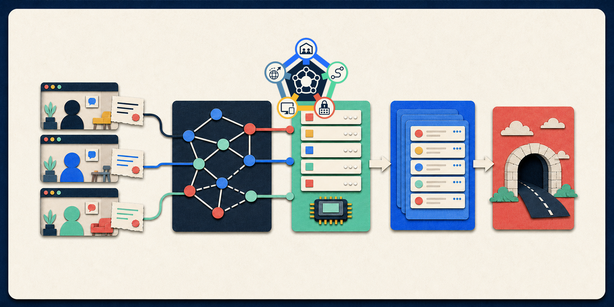

# NexusRealtime KitBuilder02



An experimental kit factory for resilient browser peer rooms, host-layer routing, secure local-model job orchestration, live event mirroring, and optional Cloudflare quick tunnels.

KitBuilder02 separates domain behavior from transport and infrastructure. Peer and ONNX kits accept adapters so their validation, leases, routing, and recovery behavior can run deterministically without a live PeerJS service. Node-only server and tunnel kits provide optional edge connectivity outside those domain boundaries.

## Included kits

| Kit | Role | Runtime |
| --- | --- | --- |
| `peerjs-room-kit` | rooms, presence leases, packet validation, ledgers, host election | browser and Node |
| `peerjs-hostlayer-kit` | room routing, path validation, direct-link negotiation, fallback | browser and Node |
| `secure-peer-onnx-kit` | model startup, job claims, result validation, provider fallback | browser and Node |
| `live-server-kit` | HTTP, SSE, and WebSocket event/snapshot mirror | Node |
| `cloudflare-tunnel-kit` | optional `cloudflared` quick-tunnel process and runtime manifest | Node |

All five kit manifests are version `0.1.0`, marked `experimental`, and currently tracked at lifecycle stage 16 of 20. None is promotion-ready.

## Verify locally

```bash
npm run check
```

This validates kit manifests, runs the Node test suite, and executes the deterministic fabric smoke.

## Live mirror

```bash
npm run live:server
curl http://127.0.0.1:8787/health
```

The local server supports snapshots, events, presence, route summaries, relay mailboxes, SSE, and WebSocket subscriptions. See [operations](docs/operations.md) for endpoint examples.

Optional tunnel commands:

```bash
npm run live:doctor
npm run live:fabric
```

`live:fabric` may expose the local server through a public Cloudflare quick tunnel when `cloudflared` is available. Review the security configuration first. The checked-in development defaults do not require signed packets or invite tokens.

## Kit lifecycle

KitBuilder tracks each kit through 20 ordered states from `idea_captured` to `promotion_ready`. Project records, local issues, and durable lessons live under `.kitbuilder/`.

```bash
npm run kit:state
npm run kit:examples
npm run kit:check
npm run kit:registry
npm run kit:doctor
```

See the [documentation index](docs/README.md), [architecture](docs/architecture.md), [kit catalog](docs/kit-catalog.md), and [lifecycle guide](docs/kitbuilder-lifecycle.md).
